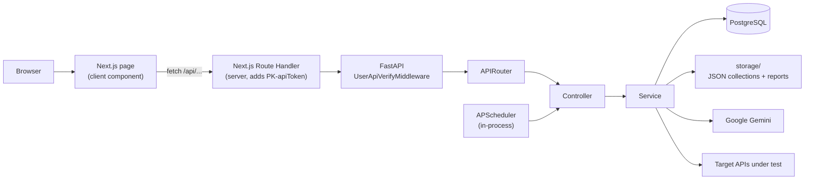

# QA API Automation

An AI-assisted API testing platform. Upload a Postman collection, let Google Gemini generate test
scenarios for each endpoint, edit requests and pre/post-request scripts in the browser, run the whole
collection, and review pass/fail reports — manually or on a schedule.

| Application | Technology | Location |
| ----------- | ---------- | -------- |
| Backend | Python 3.10/3.11 · FastAPI · SQLAlchemy 2.x · PostgreSQL | [`backend/`](backend/) |
| Frontend | Next.js 16 (App Router) · React 19 · TypeScript · Tailwind v4 | [`frontend/`](frontend/) |

---

## Table of contents

- [Architecture](#architecture)
- [Features](#features)
- [Prerequisites](#prerequisites)
- [Quick start](#quick-start)
- [Environment variables](#environment-variables)
- [Running locally](#running-locally)
- [API overview](#api-overview)
- [Testing](#testing)
- [Build and deployment](#build-and-deployment)
- [Documentation](#documentation)
- [Known limitations](#known-limitations)
- [Troubleshooting](#troubleshooting)

---

## Architecture

The browser never calls FastAPI directly. Every request goes through a Next.js Route Handler that acts
as a Backend-for-Frontend (BFF) and injects the shared `PK-apiToken` header server-side, so the token is
never exposed to the client.



Because of this topology the backend has **no CORS middleware and does not need one**.

Read more: [System overview](docs/architecture/system-overview.md) ·
[Backend architecture](docs/architecture/backend-architecture.md) ·
[Frontend architecture](docs/architecture/frontend-architecture.md) ·
[Data flow](docs/architecture/data-flow.md)

---

## Features

| Feature | Status | Documentation |
| ------- | ------ | ------------- |
| Postman collection upload and parsing | Implemented | [collection-upload.md](docs/features/collection-upload.md) |
| API request editor (headers, body, params, reorder) | Implemented | [api-editor.md](docs/features/api-editor.md) |
| AI test-scenario generation (Google Gemini) | Implemented | [ai-test-generation.md](docs/features/ai-test-generation.md) |
| Test execution engine | Implemented | [test-execution-engine.md](docs/features/test-execution-engine.md) |
| Pre/post-request scripts (`pm.*`) | Implemented | [pre-post-request-scripts.md](docs/features/pre-post-request-scripts.md) |
| Reporting (run list, run detail, per-API detail) | Implemented | [reporting.md](docs/features/reporting.md) |
| Scheduler (cron / interval runs) | Implemented | [scheduler.md](docs/features/scheduler.md) |
| Projects | Implemented, not linked in navigation | [projects.md](docs/features/projects.md) |
| Documents / KYC extraction | Implemented, not linked in navigation | [documents-kyc.md](docs/features/documents-kyc.md) |
| Legal-AI categories | Frontend only — backend absent | [legal-ai-categories.md](docs/features/legal-ai-categories.md) |
| Dashboard and Home | Placeholder screens | [dashboard-and-home.md](docs/features/dashboard-and-home.md) |
| Authentication / Authorization | Shared static API token only | [authentication-and-authorization.md](docs/security/authentication-and-authorization.md) |

---

## Prerequisites

| Requirement | Version | Notes |
| ----------- | ------- | ----- |
| Python | 3.10 or 3.11 | Stated in `backend/readme.md` |
| PostgreSQL | any recent 12+ | Connection built in `app/database/connection.py` |
| Node.js | v24.12.0 | Linked from `frontend/README.md` |
| npm | bundled with Node | Only `package-lock.json` is present |
| Google Gemini API key | — | Required; the backend raises on startup without it |

Full detail: [docs/setup/prerequisites.md](docs/setup/prerequisites.md)

---

## Quick start

```bash
# 1. Database — create an empty database (tables are created automatically on first boot)
createdb ai_qa_automation

# 2. Backend
cd backend
python -m venv venv
.\venv\Scripts\activate                    # Windows;  source venv/bin/activate on macOS/Linux
python -m pip install --upgrade pip
pip install torch==2.9.1 torchaudio==2.9.1 --index-url https://download.pytorch.org/whl/cpu
pip install -r requirements.txt            # see note below
pip install apscheduler requests pillow    # required; missing from requirements.txt
# create backend/.env  (see Environment variables)
uvicorn app.main:app --reload --host 0.0.0.0 --port 8000

# 3. Frontend (new terminal)
cd frontend
npm i
# create frontend/.env.local  (see Environment variables)
npm run dev
```

> **Note on `pip install -r requirements.txt`.** This is the command documented in the repository, but
> `requirements.txt` is currently saved as UTF-16 and pip cannot parse it. Convert it to UTF-8 first —
> see [docs/setup/backend-setup.md](docs/setup/backend-setup.md#step-6--install-dependencies) for the
> exact workaround. Three imported packages (`apscheduler`, `requests`, `Pillow`) are also absent from
> the file and must be installed explicitly.

Open <http://localhost:3000>. The root path redirects to `/home`.

---

## Environment variables

Neither `.env` file is committed (`.gitignore` excludes `.env*`). Create both by hand.

### `backend/.env` — required

| Variable | Purpose | Example |
| -------- | ------- | ------- |
| `DB_HOST` | PostgreSQL host | `localhost` |
| `DB_PORT` | PostgreSQL port | `5432` |
| `DB_NAME` | Database name | `ai_qa_automation` |
| `DB_USERNAME` | Database user | `postgres` |
| `DB_PASSWORD` | Database password | `<secret>` |
| `API_TOKEN` | Shared application token checked on every request | `<secret>` |
| `TOKEN_SECRET` | Seed for the Fernet key built in `app/utils/crypto.py` | `<secret>` |
| `GOOGLE_API_KEY` | Google Gemini API key | `<secret>` |
| `STORAGE_DIR` | Root directory for collections and reports | `storage` |
| `BASE_URL` | Public base URL, used to build document URLs | `http://127.0.0.1:8000/` |

### `frontend/.env.local` — required

| Variable | Purpose | Example |
| -------- | ------- | ------- |
| `NEXT_PUBLIC_API_URL` | Backend base URL — **must end with `/`** | `http://127.0.0.1:8000/` |
| `API_TOKEN` | Sent as `PK-apiToken`; must match the backend value. Server-only — do not prefix with `NEXT_PUBLIC_` | `<secret>` |

The complete inventory, including variables that are present but unused, is in
[docs/setup/environment-variables.md](docs/setup/environment-variables.md).

---

## Running locally

Start components in this order:

```
PostgreSQL (5432)
      ↓
Backend  (8000)   — starts APScheduler in-process
      ↓
Frontend (3000)
```

| Component | Technology | Port | Command | Depends on |
| --------- | ---------- | ---: | ------- | ---------- |
| Database | PostgreSQL | 5432 | external service | — |
| Backend | FastAPI / uvicorn | 8000 | `uvicorn app.main:app --reload --host 0.0.0.0 --port 8000` | PostgreSQL |
| Scheduler | APScheduler | in-process | starts automatically with the backend | Backend, PostgreSQL |
| Frontend | Next.js | 3000 | `npm run dev` | Backend |

There is **no Redis, no Celery, no message broker and no separate worker process** — scheduled runs
execute on a thread pool inside the FastAPI process.

Verify the stack:

- `GET http://localhost:8000/` → `{"message": "FastAPI MVC Running"}`
- Swagger UI → <http://localhost:8000/docs>
- Database connectivity → the backend prints a `✅ Database connected successfully!` line at startup
- Frontend → <http://localhost:3000> redirects to `/home`; `/collections` should list uploaded collections

Details: [docs/setup/local-development.md](docs/setup/local-development.md)

---

## API overview

All endpoints require the header `PK-apiToken`. Every response uses a fixed envelope returned with
**HTTP 200**, including errors:

```json
{ "Success": { "message": "...", "data": {} }, "Code": 0,    "Error": null }
{ "Success": null,                             "Code": 4000, "Error": { "message": "..." } }
```

| Group | Prefix | Endpoints | Reference |
| ----- | ------ | --------- | --------- |
| Collection Management | `/collections` | 5 | [collections-and-environments.md](docs/api/collections-and-environments.md) |
| Environment Management | `/environment` | 3 | [collections-and-environments.md](docs/api/collections-and-environments.md) |
| APIs Management | `/api` | 3 | [apis-and-test-cases.md](docs/api/apis-and-test-cases.md) |
| Test Case Management | `/api-test` | 3 | [apis-and-test-cases.md](docs/api/apis-and-test-cases.md) |
| Report Management | `/report` | 3 | [reports.md](docs/api/reports.md) |
| Scheduler Management | `/scheduler` | 3 | [scheduler.md](docs/api/scheduler.md) |
| Project Management | `/project` | 5 | [projects-and-documents.md](docs/api/projects-and-documents.md) |
| Document Management | `/document` | 5 | [projects-and-documents.md](docs/api/projects-and-documents.md) |

Conventions and the full error-code table: [docs/api/overview.md](docs/api/overview.md) ·
[docs/api/error-codes.md](docs/api/error-codes.md)

---

## Testing

**This repository contains no automated tests.** There is no pytest suite, no Jest/Vitest setup, no
Playwright configuration and no CI pipeline. The `test_*.py` files under `backend/app/` are application
source code for the QA-testing feature, not test suites.

See [docs/testing/testing-status.md](docs/testing/testing-status.md) for the full picture and what a
first test suite would need to cover.

---

## Build and deployment

| Task | Command | Directory |
| ---- | ------- | --------- |
| Backend production server | `uvicorn app.main:app --host 0.0.0.0 --port 8000` | `backend` |
| Frontend production build | `npm run build` | `frontend` |
| Frontend production server | `npm run start` | `frontend` |
| Frontend lint | `npm run lint` | `frontend` |

Convenience scripts `frontend/run-dev.bat` and `frontend/run-prod.bat` wrap the npm commands on Windows.

There is **no Dockerfile, no docker-compose file, no Makefile and no CI/CD configuration** in the
repository. Backend linting, formatting and type-checking are not configured.

---

## Documentation

| Area | Entry point |
| ---- | ----------- |
| Documentation index | [docs/README.md](docs/README.md) |
| Architecture | [docs/architecture/](docs/architecture/) |
| Setup and configuration | [docs/setup/](docs/setup/) |
| API reference | [docs/api/](docs/api/) |
| Database schema | [docs/database/schema.md](docs/database/schema.md) |
| Features | [docs/features/](docs/features/) |
| Integrations | [docs/integrations/google-gemini.md](docs/integrations/google-gemini.md) |
| Security | [docs/security/authentication-and-authorization.md](docs/security/authentication-and-authorization.md) |
| Testing | [docs/testing/testing-status.md](docs/testing/testing-status.md) |
| Troubleshooting | [docs/troubleshooting/common-issues.md](docs/troubleshooting/common-issues.md) |
| **Code audit — 36 confirmed issues** | [AUDIT.md](AUDIT.md) |

---

## Known limitations

- **No user authentication.** Access is controlled by a single shared `API_TOKEN`. There are no users,
  roles, permissions, sessions or login screen. See
  [authentication-and-authorization.md](docs/security/authentication-and-authorization.md).
- **No database migrations.** Tables are created by `Base.metadata.create_all()` at startup, which
  creates missing tables but never alters existing ones. Column changes require manual DDL.
- **Errors return HTTP 200.** Clients must inspect the `Code` field, not the status code.
- **The `pm.*` surface offered by the script editor is larger than the runtime supports.** See
  [pre-post-request-scripts.md](docs/features/pre-post-request-scripts.md) for the supported subset.
- **Scheduled runs do not execute pre/post-request scripts.** The scheduler uses a separate synchronous
  engine. See [scheduler.md](docs/features/scheduler.md).
- **Uploaded files and test reports are served without authentication.** The `/storage` mount is exempt
  from token verification, so collections, environment files and reports are downloadable by anyone who
  can reach the backend. Do not expose the backend port beyond localhost.
- 36 confirmed issues are catalogued with evidence in [AUDIT.md](AUDIT.md).

---

## Troubleshooting

Common failures — dependency install, Python/Node mismatch, database connection, missing environment
variables, port conflicts, frontend/backend connectivity — are covered in
[docs/troubleshooting/common-issues.md](docs/troubleshooting/common-issues.md).
