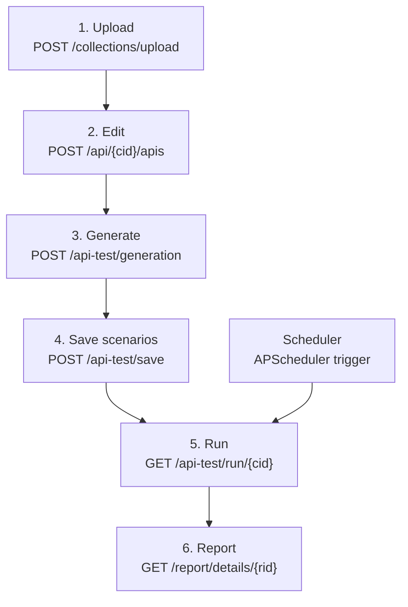
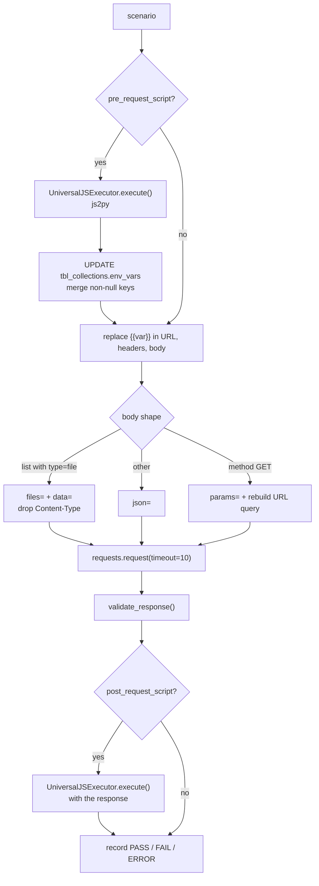
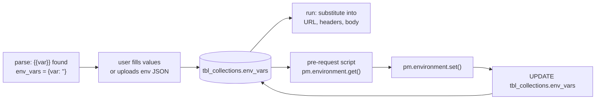

# Data Flow

The end-to-end journey of a collection, from upload to report. Every step is traced to source.

## The five stages



---

## Stage 1 — Upload and parse

**Trigger:** the user drops a Postman collection export on `/uploadeCollection`.

```
Browser
  → POST /api/collectionsUpload            (multipart)
  → POST /collections/upload
  → upload_collection_controller           extension check
  → validate_json_file()                   extension + MIME + JSON.parse
  → parse_postman_collection()             walks the tree
  → INSERT tbl_collections
  → save_collection_file()                 storage/collections/{id}/collection_{ts}.json
  → synthesise environment JSON            storage/collections/{id}/environment_{ts}.json
  → INSERT tbl_environments (one row per variable)
  → INSERT tbl_api_endpoints (one row per request, api_order = 1..n)
  → 200 { id (encoded), name, env_variables, total_apis, apis[] }
```

[`parse_postman_collection`](../../backend/app/utils/collection_parser.py) recurses through nested
folders via `walk(items)`, and for each request extracts:

| Extracted | How |
| --------- | --- |
| `url` | `request.url.raw`, or the raw string if `url` is not an object |
| `query_params` | `request.url.query` → `{"mode": "query", "query": [...]}` |
| `headers` | `request.header[]` flattened to a dict |
| `body_type` | `detect_body_type()` → `formdata`, `urlencoded`, `json`, `raw`, `graphql`, or `query` |
| `request_body` | For `json`, `normalize_postman_raw_json()`; for `formdata`/`urlencoded`, the body verbatim |
| `response_body` | The **first** saved example response, JSON-parsed if possible |
| environment variables | `{{var}}` occurrences in URL, header values and raw body, collected into a set |

`normalize_postman_raw_json` strips `//` comments and rewrites `{{var}}` as `"{{var}}"` so the body parses
as valid JSON, preserving the placeholder for later substitution.

Detected variables become `tbl_collections.env_vars` as `{var: ""}` — keys with empty values, ready for
the user to fill in.

> Only `body_type == "json"` bodies are normalised. A `raw` body that is not JSON (XML, plain text) is
> detected as `raw` but **no `request_body` is stored**, so it will not be sent during a run.

---

## Stage 2 — Edit the request

The workbench loads one API at a time via `GET /api/{cid}/apis/{api_id}` and calls `hydrateRequestBody()`
to decide which editor to show:

| Stored shape | Editor |
| ------------ | ------ |
| `{mode:"raw", raw:{…}}` | JSON editor |
| `{mode:"raw", raw:null}` **and** query params present | Params table |
| `{mode:"query"}` or a URL containing `?` | Params table |
| `{mode:"urlencoded", urlencoded:[…]}` | Key/value table |
| `{mode:"formdata", formdata:[…]}` | Key/value/type table with file rows |

Saving calls `buildApiPayload()`, which reverses the mapping and posts to `POST /api/{cid}/apis`. The
backend restricts writes to an allow-list:

```python
ALLOWED_FIELDS = {"name", "method", "url", "headers", "query_params",
                  "request_body", "pre_request_script", "post_request_script", "test_scenario"}
```

Reordering is separate: drag-and-drop updates local state, then `POST /collections/reorder_api` rewrites
`api_order` from the array position.

---

## Stage 3 — Generate scenarios

```
Browser (comment box)
  → POST /api/testGeneration  { apiId, comment }
  → POST /api-test/generation
  → get_api_details()                      load the endpoint
  → normalize_request_body() ×4            headers, query_params, request_body, response_body
  → generate_test_cases(comment, query_params, request_body, response_body)
      → format_postman_request_body()      canonicalise to {mode, <mode>}
      → build prompt
      → llm.invoke([HumanMessage(...)])    Gemini
      → clean_gemini_json()                strip ``` fences, extract the first {...}
      → json.loads()  (on failure → {"test_scenario": []})
  → 200 { apiId, name, url, method, body_type, headers, query_params,
          request_body, response_body, has_env_vars, test_scenarios }
```

The result is **not persisted** at this point — it is returned to the browser and held in component
state. See [../features/ai-test-generation.md](../features/ai-test-generation.md).

---

## Stage 4 — Save scenarios

`POST /api-test/save` with `{apiId, testCase: [...]}` writes the array to
`tbl_api_endpoints.test_scenario` (JSONB). The frontend sends only the scenarios the user has ticked, and
attaches per-scenario `pre_request_script` / `post_request_script` objects built from the Monaco editors.

---

## Stage 5 — Run

```
GET /api-test/run/{collection_id}
  → decrypt_simple_id()
  → SELECT tbl_collections
  → SELECT tbl_api_endpoints WHERE collection_id=… AND status=1 ORDER BY api_order
  → INSERT tbl_test_reports                        (the run header)
  → for each api:  execute_tests(db, collection, api)
  → bulk INSERT tbl_api_test_reports
  → UPDATE tbl_test_reports with the aggregates
  → 200 { report_id, collection_id, collection_name, total_* }
```

Inside `execute_tests` → `run_tests`, per scenario:



If an endpoint has no saved `test_scenario`, a default scenario is synthesised from the stored request
asserting only `status_code == 200`.

Results are written to `storage/collections/{cid}/test_report/{api_id}/report_{ts}.json`:

```json
{
  "environment": { "...": "final env_vars" },
  "summary": { "total": 3, "passed": 2, "failed": 1, "errors": 0 },
  "test_results": [ { "test_name": "...", "validations": [...], "overall_result": "PASS" } ],
  "execution_time": "2026-02-11 07:05:52",
  "total_execution_time": 1843.21
}
```

The database stores only the path and the counts.

---

## Stage 6 — Report

| Level | Endpoint | Source |
| ----- | -------- | ------ |
| Run list | `POST /report/list` | `tbl_test_reports` |
| Run detail | `GET /report/details/{report_id}` | `tbl_test_reports` joined to `tbl_api_test_reports` + `tbl_api_endpoints` |
| Per-API detail | `GET /report/details/{report_id}/api/{api_id}` | reads the JSON file from disk |

The per-API endpoint is the only one that touches the filesystem on read; if `storage/` is lost, the
summary rows survive but the detail is gone.

---

## Environment variable lifecycle

Variables flow through the system in a loop, which is what makes chained authentication work:



The write-back in
[`execute_script`](../../backend/app/services/test_case_service.py) merges only non-`None` values:

```python
xx_env_vars = env_vars.copy()
xx_env_vars.update({k: v for k, v in updated_env.items() if v is not None})
db.execute(update(Collection).where(Collection.id == collection_id).values(env_vars=xx_env_vars))
db.commit()
```

Because this is a real database write, **a run mutates the collection's stored environment.** A login
request that sets a token in a post-request script leaves that token in `env_vars` for every later
request — and for the next run.

---

## Scheduled runs take a different path

```
APScheduler trigger
  → execute_job(payload={"collection_id": …})       app/scheduler/tasks.py
  → SessionLocal()                                  its own session, no Depends
  → TestCaseController.run_scheduler_test_case()
  → scheduler_execute_tests()                       test_case_service_scheduler.py
```

`test_case_service_scheduler.py` is a synchronous near-copy of the main engine that **does not execute
pre- or post-request scripts**. A collection that depends on a pre-request script to build an auth header
will pass manually and fail on a schedule. See [AUDIT.md](../../AUDIT.md) issue 25.
