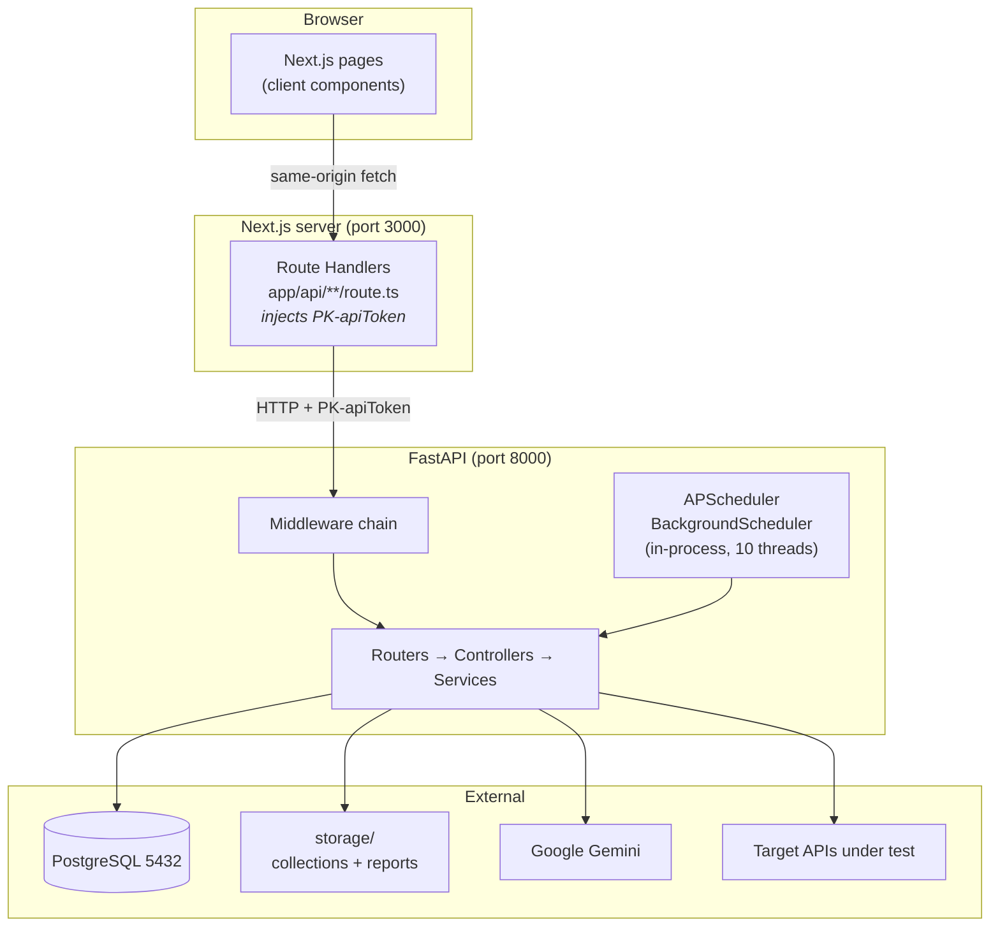

# System Overview

## What the system does

QA API Automation lets a QA engineer upload a Postman collection, have Google Gemini propose test
scenarios for each endpoint, refine those scenarios and the underlying requests in a browser workbench,
execute the whole collection against a live target system, and review the results — on demand or on a
cron/interval schedule.

## Topology



## The BFF pattern

The single most important architectural fact: **the browser never talks to FastAPI.**

Every page calls a relative path such as `/api/collectionList`. That path resolves to a Next.js Route
Handler running on the Next.js server, which reads `API_TOKEN` from the server-side environment, attaches
it as `PK-apiToken`, and forwards the call to FastAPI.

Three consequences follow directly:

1. **The shared token is never exposed to the browser.** `API_TOKEN` deliberately has no
   `NEXT_PUBLIC_` prefix, so Next.js will not inline it into the client bundle.
2. **The backend needs no CORS configuration**, and has none. All browser traffic is same-origin.
3. **`NEXT_PUBLIC_API_URL` is only used server-side**, despite its name — see
   [frontend-architecture.md](frontend-architecture.md).

Every route handler follows the same shape, verified across all 30 of them:

```ts
export async function POST(req: Request) {
  const body = await req.json();
  const backendRes = await fetch(`${API_URL}collections/list`, {
    method: "POST",
    headers: {
      accept: "application/json",
      "Content-Type": "application/json",
      "PK-apiToken": API_TOKEN,
      "PK-role": "User",
      "PK-country": "IN",
      "PK-timezone": "Asia/Kolkata",
    },
    body: JSON.stringify(body),
  });
  const data = await backendRes.json();
  return NextResponse.json(data, { status: backendRes.status });
}
```

Note `${API_URL}collections/list` — direct concatenation with no separator. **`NEXT_PUBLIC_API_URL` must
therefore end with a trailing slash.** Two handlers
(`projects/project-list`, `projects/project-delete`) instead use `API_URL.replace(/\/$/, "")` and add
their own slash, so they tolerate either form.

## Request lifecycle

```
Browser fetch("/api/...")
  │
  ├─ Next.js Route Handler ─ adds PK-apiToken, PK-role, PK-country, PK-timezone
  │
  ▼  HTTP to FastAPI
RequestLoggingMiddleware      reads + rebuilds the body, logs request and response
  │
GlobalExceptionMiddleware     catches unhandled errors → 500 envelope
  │
UserApiVerifyMiddleware       PK-apiToken == env("API_TOKEN") ?
  │                           sets request.state.country / timezone / dialing_code / base_url
  ▼
APIRouter                     Depends(SwaggerAPIHeaders) — documentation only, enforces nothing
  │
Controller                    decrypts IDs, validates, shapes the response
  │
Service                       business logic — DB, filesystem, outbound HTTP, LLM
  │
Model / storage / requests / Gemini
  │
  ▼
success_response() | error_response()   →  always HTTP 200, {Success, Code, Error}
```

Middleware is registered in [`app/main.py`](../../backend/app/main.py) in the order
`RequestLoggingMiddleware`, `UserApiVerifyMiddleware`, then `GlobalExceptionMiddleware` (via
`register_exception_handlers`). Starlette executes the **last-added first**, giving the effective order
shown above: exception handling wraps token verification, which wraps logging.

`ALLOWED_PATHS = ["/", "/docs", "/redoc", "/openapi.json"]` and any path starting with `/storage` bypass
token verification.

## Technology inventory

| Concern | Choice | Where |
| ------- | ------ | ----- |
| Web framework | FastAPI | [`app/main.py`](../../backend/app/main.py) |
| ORM | SQLAlchemy 2.x, `DeclarativeBase` | [`app/database/connection.py`](../../backend/app/database/connection.py) |
| Database | PostgreSQL via `psycopg2` | same |
| Scheduling | APScheduler `BackgroundScheduler` + `SQLAlchemyJobStore` | [`app/scheduler/scheduler.py`](../../backend/app/scheduler/scheduler.py) |
| LLM | Google Gemini via `langchain-google-genai` | [`app/utils/test_case_llm.py`](../../backend/app/utils/test_case_llm.py) |
| JS execution | `js2py`, emulating Postman's `pm.*` | [`app/utils/universal_runner.py`](../../backend/app/utils/universal_runner.py) |
| Outbound HTTP | `requests` | [`app/services/test_case_service.py`](../../backend/app/services/test_case_service.py) |
| Document parsing | PyMuPDF (`fitz`), `python-docx`, Pillow, Gemini Vision | [`app/utils/kyc_document_parser.py`](../../backend/app/utils/kyc_document_parser.py) |
| Frontend framework | Next.js 16 App Router, React 19 | [`frontend/package.json`](../../frontend/package.json) |
| Styling | Tailwind CSS v4 | [`frontend/tailwind.config.ts`](../../frontend/tailwind.config.ts) |
| Code editor | `@monaco-editor/react` | workbench pages |
| Drag and drop | `@dnd-kit` | workbench pages |

## What is deliberately absent

| Not present | Consequence |
| ----------- | ----------- |
| Redis, Celery, message broker | Scheduled runs execute on an in-process thread pool |
| CORS middleware | Correct — all browser traffic is same-origin |
| Database migrations | Tables are created by `create_all()`; columns are never altered |
| User authentication | A single shared token guards every endpoint |
| Automated tests | See [testing-status.md](../testing/testing-status.md) |
| Docker, CI/CD | No `Dockerfile`, `docker-compose`, `Makefile` or pipeline configuration |

## Persistence split

State lives in two places, and both matter:

- **PostgreSQL** holds collections, endpoints, environments, scheduler jobs, projects, documents and the
  *summary* rows for test runs.
- **The filesystem** (`STORAGE_DIR`) holds the uploaded collection JSON, the uploaded environment JSON,
  and the *full* per-API test report for every run. `tbl_api_test_reports.test_report_file` stores the
  path; `GET /report/details/{report_id}/api/{api_id}` reads that file from disk at request time.

Deleting `storage/` therefore destroys report detail even though the database rows survive.
