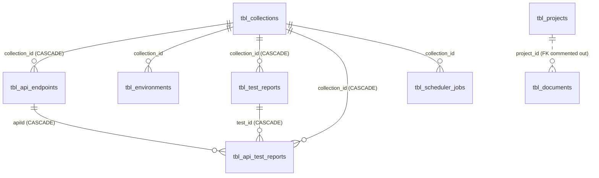

# Database Schema

PostgreSQL. Eight application tables defined as SQLAlchemy models in
[`backend/app/models/`](../../backend/app/models/), plus one table created by APScheduler.

> **Source of truth.** This document is derived from the model definitions. The live database schema
> could not be inspected — there is no dump, no migration history and no DDL in the repository. Because
> `create_all()` never alters existing tables, a long-lived database may have drifted from these models.
> **The live schema is not verified from the current implementation.**

---

## Entity relationships



`tbl_projects` and `tbl_documents` form an island unconnected to the testing tables.

---

## Summary

| Table | Purpose | Parent | Used by |
| ----- | ------- | ------ | ------- |
| `tbl_collections` | An uploaded Postman collection and its live environment | — | Every testing feature |
| `tbl_api_endpoints` | One API request within a collection | `tbl_collections` | Editor, execution engine |
| `tbl_environments` | Per-key environment rows | `tbl_collections` | **Written at upload, never read** |
| `tbl_test_reports` | Header row for one test run | `tbl_collections` | Reporting |
| `tbl_api_test_reports` | Per-endpoint result within a run | `tbl_test_reports`, `tbl_api_endpoints` | Reporting |
| `tbl_scheduler_jobs` | A cron/interval schedule | `tbl_collections` | Scheduler |
| `tbl_projects` | Project master | — | Projects feature |
| `tbl_documents` | Document rule set and extraction result | `tbl_projects` (logical only) | Documents/KYC feature |
| `apscheduler_jobs` | APScheduler's serialised job store | — | APScheduler internals |

---

## Audit columns

Every application table carries the same six columns:

| Column | Type | Default |
| ------ | ---- | ------- |
| `createdBy` | Integer, nullable | — |
| `createdAt` | DateTime | `datetime.utcnow` |
| `updatedBy` | Integer, nullable | — |
| `updatedAt` | DateTime | `utcnow`, `onupdate=utcnow` |
| `deletedBy` | Integer, nullable | — |
| `deletedAt` | DateTime, nullable | — |

Two things to know:

- **`createdBy`/`updatedBy` are meaningless.** There are no users. Project and document services
  hard-code `admin_id = 1`; the testing tables leave them null.
- **Timestamps are UTC, presented as IST.** Every model exposes `createdAtFormatted` and
  `updatedAtFormatted` properties that apply a hard-coded `timezone(timedelta(hours=5, minutes=30))` and
  format as `"%d-%b-%Y %H:%M:%S"`. API responses return the formatted strings, with no timezone marker.

Soft-delete convention differs by module: testing tables use `status` as a `SmallInteger` (`1` active),
projects and documents set `status = -1` on delete, and `tbl_scheduler_jobs` uses a `Boolean`.

---

## `tbl_collections`

[`tbl_collections.py`](../../backend/app/models/tbl_collections.py)

| Column | Type | Notes |
| ------ | ---- | ----- |
| `id` | Integer PK, indexed | Exposed base64-encoded in the API |
| `name` | String(255), NOT NULL | From `info.name` in the Postman export |
| `collection_type` | String(50), NOT NULL | Always `"postman"` — hard-coded at upload |
| `collection_path` | String(512) | Path to the stored collection JSON |
| `env_path` | String(512), nullable | Path to the stored environment JSON |
| `env_vars` | `MutableDict.as_mutable(JSON)`, nullable | **The live environment.** Read at every run; written by post-request scripts |
| `status` | SmallInteger, default 1 | |

`env_vars` is the most important column in the schema. `MutableDict` makes SQLAlchemy detect in-place
mutations, so changes propagate without an explicit `flag_modified`.

`generate_collection_uid()` produces `C-XXXXXXXX` identifiers but is **never called**. `encrypted_id` is
intended as a property but its decorator is inside a comment, making it a plain method
([AUDIT.md](../../AUDIT.md) issue 15).

---

## `tbl_api_endpoints`

[`tbl_api_endpoints.py`](../../backend/app/models/tbl_api_endpoints.py)

| Column | Type | Notes |
| ------ | ---- | ----- |
| `id` | Integer PK, indexed | Plain integer in the API |
| `collection_id` | Integer FK → `tbl_collections.id` **ON DELETE CASCADE** | |
| `api_order` | Integer, NOT NULL | 1-based execution order; rewritten by reorder |
| `name` | String(255) | |
| `url` | Text | May contain `{{variables}}` |
| `method` | String(10) | |
| `headers` | JSONB | Flat `{key: value}` |
| `query_params` | JSONB | `{"mode": "query", "query": [{key, value}]}` |
| `request_body` | JSONB | Postman canonical form: `{mode, raw\|urlencoded\|formdata}` |
| `response_body` | JSONB | First saved example response from the export |
| `pre_request_script` | JSONB | `{"listen": "prerequest", "script": {"exec": [...]}}` |
| `post_request_script` | JSONB | `{"listen": "test", "script": {"exec": [...]}}` |
| `body_type` | String(50), nullable | `json`, `raw`, `formdata`, `urlencoded`, `graphql`, `query` |
| `test_scenario` | JSONB | **Array of scenarios — no schema enforcement** |
| `test_case_file` | Text | Declared, **never written** |
| `has_env_vars` | Boolean, default False | True if the collection had any variables |
| `status` | SmallInteger, default 1 | Only `1` rows are executed |

`test_scenario` holds the entire generated/edited test suite for the endpoint. `POST /api-test/save`
types it as `List[Dict]`, so its internal shape is a convention, not a constraint — documented in
[../features/ai-test-generation.md](../features/ai-test-generation.md).

---

## `tbl_environments`

[`tbl_environments.py`](../../backend/app/models/tbl_environments.py)

| Column | Type | Notes |
| ------ | ---- | ----- |
| `id` | Integer PK | |
| `collection_id` | Integer FK → `tbl_collections.id` | No cascade |
| `key` | String(255) | Variable name |
| `value` | String(1024), nullable | **Never populated** — rows are inserted with key only |

**This table is written once at collection upload and never read.** The runtime environment lives in
`tbl_collections.env_vars`. It is effectively dead storage.

`createdAt` is declared twice in the model ([AUDIT.md](../../AUDIT.md) issue 14).

---

## `tbl_test_reports`

[`tbl_test_reports.py`](../../backend/app/models/tbl_test_reports.py)

| Column | Type | Notes |
| ------ | ---- | ----- |
| `id` | Integer PK, indexed | The `report_id` in the API |
| `collection_id` | Integer FK → `tbl_collections.id` **CASCADE** | |
| `collection_name` | String | **Denormalised** — survives a rename |
| `total_apis` | Integer, default 0 | Endpoints that produced a report |
| `total_tests` | Integer, default 0 | Scenarios executed |
| `total_passed` / `total_failed` / `total_errors` | Integer, default 0 | |
| `total_execution_time` | Float, default 0 | Wall-clock milliseconds |
| `status` | SmallInteger, default 1 | |

The row is inserted **before** execution with zeroed counters and updated afterwards, so a crashed run
leaves a row of zeros behind. There is no `scheduler_job_id`, so scheduled and manual runs cannot be
told apart.

---

## `tbl_api_test_reports`

[`tbl_api_test_reports.py`](../../backend/app/models/tbl_api_test_reports.py)

| Column | Type | Notes |
| ------ | ---- | ----- |
| `id` | Integer PK, indexed | |
| `collection_id` | Integer FK → `tbl_collections.id` **CASCADE** | |
| `test_id` | Integer FK → `tbl_test_reports.id` **CASCADE** | The run |
| `apiId` | Integer FK → `tbl_api_endpoints.id` **CASCADE** | camelCase, unlike its siblings |
| `test_report_file` | Text | **Filesystem path to the full JSON report** |
| `test_total` / `test_passed` / `test_failed` / `test_errors` | Integer, default 0 | |
| `total_execution_time` | Float, default 0 | |
| `status` | SmallInteger, default 1 | |

`test_report_file` is the bridge between the database and the filesystem. The cascade on `apiId` means
**hard-deleting an endpoint destroys its historical results**, while the parent run keeps counting them.

---

## `tbl_scheduler_jobs`

[`tbl_scheduler_jobs.py`](../../backend/app/models/tbl_scheduler_jobs.py)

| Column | Type | Notes |
| ------ | ---- | ----- |
| `id` | Integer PK, indexed | Used by the delete endpoint |
| `job_id` | String(255), **UNIQUE**, NOT NULL | APScheduler's job identifier |
| `job_name` | String(200), NOT NULL | |
| `job_type` | String(20), NOT NULL | |
| `cron_year` … `cron_second` | String(20) × 8 | `year, month, day, week, day_of_week, hour, minute, second` |
| `interval_seconds` / `interval_minutes` / `interval_hours` | Integer | |
| `collection_id` | Integer FK → `tbl_collections.id`, NOT NULL | |
| `payload` | JSON | **Always null** — the loader builds its own payload |
| `status` | Boolean, default True | `False` = soft-deleted |
| `timezone` | String(50), default `"Asia/Kolkata"` | |

**Constraint:** `CheckConstraint("job_type IN ('cron', 'interval', 'date')", name="check_job_type")`.
Note the mismatch — the database permits `'date'`, but the `JobType` enum in the request schema allows
only `cron` and `interval`, and `load_jobs_from_db` has no branch for `date`. A `date` job could be
inserted directly into the database and would never run.

`job_id` is generated by a `before_insert` event listener:

```python
target.job_id = f"{slugify(target.job_name)}_{next_id}"
```

`next_id` comes from `SELECT COALESCE(MAX(id), 0) + 1`, which is **not concurrency-safe** — two
simultaneous inserts can compute the same value and collide on the unique index.

This is the only model with a declared ORM relationship: `collection = relationship("Collection", lazy="selectin")`.

---

## `tbl_projects`

[`tbl_projects.py`](../../backend/app/models/tbl_projects.py)

| Column | Type | Notes |
| ------ | ---- | ----- |
| `id` | Integer PK, indexed | |
| `name` | String(255), nullable | Required by service-level validation |
| `description` | String(500), nullable | |
| `status` | Integer, default 1 | `-1` = soft-deleted |

`ProjectService.update_master` also assigns `imageId` and `imagePath`, which are not columns
([AUDIT.md](../../AUDIT.md) issue 13).

---

## `tbl_documents`

[`tbl_documents.py`](../../backend/app/models/tbl_documents.py)

| Column | Type | Notes |
| ------ | ---- | ----- |
| `id` | Integer PK, indexed | |
| `project_id` | Integer, nullable | **Foreign key is commented out** — no referential integrity |
| `name` | String(255), nullable | |
| `rules` | JSONB | `[{rule: str, mandatory: bool}]` |
| `file_path` | String(255), nullable | Relative path to the uploaded file |
| `result` | JSONB | Extraction output |
| `status` | Integer, default 1 | |

`file_path_url` is a read-only property returning `BASE_URL + file_path.lstrip("/")`.

Because the foreign key is commented out, deleting a project orphans its documents rather than cascading
or failing.

---

## `apscheduler_jobs`

Created automatically by `SQLAlchemyJobStore(engine=engine)` on the shared engine. It stores serialised
triggers and next-run times and is managed entirely by APScheduler.

Two job registries therefore coexist: `tbl_scheduler_jobs` (the application's view) and
`apscheduler_jobs` (the scheduler's own). They are kept in sync only through the create and delete
endpoints — editing either directly desynchronises them.

---

## Indexes and constraints

**Indexes.** Only `index=True` on the primary keys of `tbl_collections`, `tbl_api_endpoints`,
`tbl_test_reports`, `tbl_api_test_reports`, `tbl_scheduler_jobs`, `tbl_projects` and `tbl_documents`,
plus the unique index behind `tbl_scheduler_jobs.job_id`.

**No secondary indexes exist**, including on columns that every query filters by:

| Unindexed column | Filtered by |
| ---------------- | ----------- |
| `tbl_api_endpoints.collection_id` | Every API list, every run |
| `tbl_api_test_reports.test_id` | Every report detail |
| `tbl_api_test_reports.apiId` | Every per-API report |
| `tbl_test_reports.collection_id` | Report queries |
| `tbl_documents.project_id` | Every document list |
| `status` on every table | Nearly every query |

At current data volumes this is not noticeable; PostgreSQL will sequentially scan. The 300 ms slow-query
logger in [`connection.py`](../../backend/app/database/connection.py) will surface it when it becomes a
problem.

**Constraints.** One `CheckConstraint` (`check_job_type`) and one unique constraint
(`tbl_scheduler_jobs.job_id`) in the entire schema. No `NOT NULL` on most business columns, no unique
constraint on collection names, no composite keys.

---

## Migrations

None. See [../setup/database-setup.md](../setup/database-setup.md#migrations) and
[AUDIT.md](../../AUDIT.md) issue 20.
