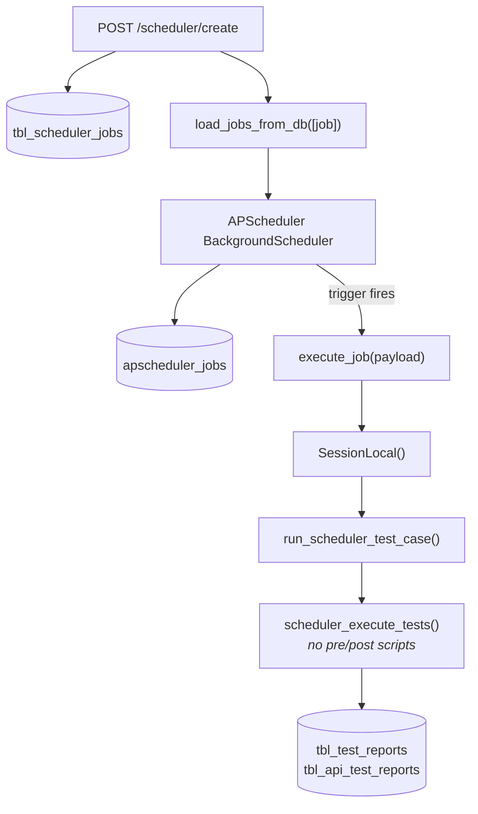

# Feature — Scheduler

## Overview

Runs a collection automatically on a cron expression or a fixed interval, using APScheduler inside the
FastAPI process.

**Status:** Implemented, with significant caveats — scheduled runs behave differently from manual ones,
and the scheduler-report page has no backend.

## Business purpose

Regression suites are only useful when they run without being asked. A nightly cron over a collection
turns the tool from an interactive workbench into continuous monitoring.

## User flow

1. Open the scheduler popup from the workbench, or **Sheduler List** (`/shedularList`) in the sidebar.
2. Choose **cron** or **interval**.
3. For cron, set the fields you care about; for interval, set seconds/minutes/hours.
4. Pick the collection and save. The job registers immediately — no restart.
5. `/shedularList` lists active jobs and offers delete.

## Architecture



Configuration ([`scheduler.py`](../../backend/app/scheduler/scheduler.py)):

```python
jobstores    = {"default": SQLAlchemyJobStore(engine=engine)}       # same PostgreSQL
executors    = {"default": ThreadPoolExecutor(max_workers=10)}
job_defaults = {"coalesce": True, "max_instances": 1, "misfire_grace_time": 30}
scheduler    = BackgroundScheduler(..., timezone="Asia/Kolkata")
```

| Setting | Effect |
| ------- | ------ |
| `coalesce: True` | Missed runs collapse into one, rather than firing repeatedly to catch up |
| `max_instances: 1` | A job never overlaps itself — important, since a run can take minutes |
| `misfire_grace_time: 30` | A trigger more than 30 s late is skipped entirely |
| `max_workers: 10` | Up to 10 different jobs run concurrently |
| `timezone` | Hard-coded `"Asia/Kolkata"`, **not** read from `TIMEZONE` |

## Two job registries

State lives in two tables that are only synchronised through the create and delete endpoints:

| Table | Owner | Purpose |
| ----- | ----- | ------- |
| `tbl_scheduler_jobs` | The application | User-facing definition, listed by the API |
| `apscheduler_jobs` | APScheduler | Serialised triggers and next-run times |

`job_id` is the join key. Modifying either table directly desynchronises them.

> **On restart:** application code does not reload jobs from `tbl_scheduler_jobs` —
> `load_jobs_from_db` is called only from `scheduler_create`, and `get_active_jobs()` exists but is never
> called. Persistence across restarts therefore depends entirely on APScheduler's own
> `SQLAlchemyJobStore` restoring what it previously wrote. A job deleted from `apscheduler_jobs` but left
> active in `tbl_scheduler_jobs` will be listed by the API and never fire.

## Trigger construction

```python
# cron
scheduler.add_job(execute_job, trigger="cron",
                  **{k: v for k, v in build_cron_data(job).items() if v},
                  kwargs={"payload": {"collection_id": job.collection_id}},
                  id=job.job_id, replace_existing=True)
```

The filter `if v` drops empty fields — but **`"*"` is truthy** and is passed through. Since all eight
cron fields default to `"*"`, a job that sets only `cron_hour` fires **every second** of that hour.

> Always pin `cron_minute` and `cron_second` explicitly. `{"cron_hour": "2"}` alone means 3,600 runs.

## Execution

[`tasks.py`](../../backend/app/scheduler/tasks.py):

```python
def execute_job(payload: dict):
    collection_id = payload.get("collection_id")
    if not collection_id: return
    db = SessionLocal()                 # its own session — no FastAPI Depends
    try:
        TestCaseController.run_scheduler_test_case(db=db, collection_id=collection_id)
    except Exception as e:
        print("❌ Scheduler execution failed:", str(e))
    finally:
        db.close()
```

`run_scheduler_test_case` mirrors the manual runner but calls
[`scheduler_execute_tests`](../../backend/app/services/test_case_service_scheduler.py) — a **synchronous
near-copy** of the main engine.

### The critical difference

`test_case_service_scheduler.py` **does not execute pre- or post-request scripts.** It substitutes
variables, sends the request and validates the response — nothing more.

Consequences:

- A collection whose authentication depends on a pre-request script (checksums, signed headers, token
  refresh) **passes manually and fails on a schedule**.
- Post-request scripts do not run, so no variables are captured, and chained flows break after the first
  endpoint that depends on a captured value.
- Because `env_vars` is never written back, scheduled runs are non-mutating — the one upside.

[AUDIT.md](../../AUDIT.md) issue 25.

## API details

[../api/scheduler.md](../api/scheduler.md) — create, list, delete.

## Validation

`SchedulerCreateReq` requires `job_name`, `job_type` and `collection_id`. Validators coerce `None`, `""`
and `"null"` to `"*"` on cron fields, and constrain interval values to `≥ 0`.

**What is not validated:**

- Cron expressions are not checked for validity — an invalid value reaches APScheduler and raises there.
- An `interval` job with all three interval fields at `0` is accepted; `load_jobs_from_db` filters out
  the falsy values and calls `add_job(trigger="interval")` with **no interval**, which raises.
- The database `CheckConstraint` permits `job_type = 'date'`, but the request enum does not, and
  `load_jobs_from_db` has no branch for it — a `date` row inserted directly would never run.

## Database interaction

| Table | Operation |
| ----- | --------- |
| `tbl_scheduler_jobs` | INSERT on create; SELECT on list; UPDATE (soft delete) |
| `apscheduler_jobs` | Managed by APScheduler |
| `tbl_test_reports`, `tbl_api_test_reports` | INSERT per scheduled run |

### `job_id` generation

```python
target.job_id = f"{slugify(target.job_name)}_{next_id}"     # before_insert event
next_id = connection.execute(text("SELECT COALESCE(MAX(id), 0) + 1 FROM tbl_scheduler_jobs")).scalar()
```

`MAX(id) + 1` is **not concurrency-safe** — two simultaneous creates can compute the same value and
collide on the unique index.

## Authentication

`PK-apiToken` only. Any token holder can schedule recurring outbound traffic from the backend host.

## Error handling

| Layer | Behaviour |
| ----- | --------- |
| Job execution | Caught in `execute_job`, printed to the console. **No database record of the failure** |
| Job removal | Failures swallowed, returns `False`; the API reports success regardless |
| Missing collection | `Code: 4000` at create time |
| Deleted collection | The job survives with a dangling `collection_id` and fails silently at every trigger |

There is no execution history, no failure counter and no alerting. A job that has been failing for a week
looks identical to one that has never run.

## Monitoring

| Check | How |
| ----- | --- |
| Scheduler started | `✅ Scheduler started` in `logs/app.scheduler.scheduler.log` |
| Registered jobs | Call `POST /scheduler/list`; the controller calls `list_jobs()`, printing the live list to the backend console |
| Job fired | `🚀 Scheduler Job Executing...` on the console |
| Run recorded | A new row via `POST /report/list` |

## Known limitations

1. **Scheduled runs skip pre/post-request scripts** — the highest-impact difference from manual runs.
2. **Cron fields default to `"*"`**, so an under-specified cron job fires far more often than intended.
3. **No update endpoint.** Changing a cadence means delete and recreate.
4. **`search` on the list endpoint raises `AttributeError`.** [AUDIT.md](../../AUDIT.md) issue 10.
5. **Filtering by `collection_id` is broken** — a tuple is compared against an integer column.
   [AUDIT.md](../../AUDIT.md) issue 11.
6. **`GET /scheduler/{id}/reports` does not exist**, so `/schedulerReport/[id]` can never load.
   [AUDIT.md](../../AUDIT.md) issue 16.
7. **Runs are not attributable to a schedule** — no link column on `tbl_test_reports`.
8. **In-process scheduling does not scale.** Running two backend instances means every job fires twice;
   there is no leader election or distributed lock.
9. **A reload kills in-flight jobs.** `--reload` restarts the process and the scheduler with it.
10. **The `payload` column is always null** — the loader constructs its own payload and ignores it.
11. **`job_id` generation is racy.**
12. **Timezone is hard-coded** at the scheduler level; the per-job `timezone` column is applied to cron
    triggers but the scheduler default ignores `TIMEZONE`.
