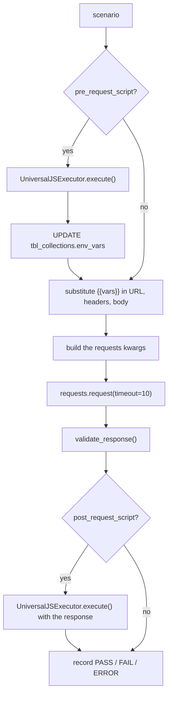

# Feature — Test Execution Engine

## Overview

Runs every active endpoint of a collection, in order, executing each endpoint's test scenarios against
the live target system, validating the responses, and writing both summary rows and detailed JSON
reports.

**Status:** Implemented. Two engines exist — one for manual runs, one for scheduled runs, and they
differ. See [Known limitations](#known-limitations).

Implementation: [`app/services/test_case_service.py`](../../backend/app/services/test_case_service.py).

## Business purpose

The payoff for everything else in the product. One click validates an entire API surface and produces
evidence of what passed, what failed, and how long each call took.

## User flow

1. Click **Run** in the workbench.
2. If environment values are missing, a confirmation dialog offers "Run Anyway".
3. If scenarios are unsaved, the run is blocked with a toast.
4. The run executes synchronously; a full-screen loader is shown.
5. On completion the browser navigates to `/test_result/{report_id}`.

## Frontend flow

```
handleRun()
  → guard: collectionId must exist            → toast "Please upload a collection first"
  → guard: !hasUnsavedScenarios               → toast "Please save your generated scenarios..."
  → if hasMissingEnvValues() → ConfirmModal("Run Anyway") → executeRun()
  → else executeRun()

executeRun()
  → GET /api/runTest/{collectionId}
  → report_id = data.Success.data.report_id
  → router.push(`/test_result/${report_id}`)
```

`hasMissingEnvValues()` flags any environment row with an empty key **or** an empty value.

## Backend flow

```
GET /api-test/run/{collection_id}
  → decrypt_simple_id
  → SELECT tbl_collections                                   Code 4000 if missing
  → SELECT tbl_api_endpoints WHERE collection_id AND status=1 ORDER BY api_order ASC
  → INSERT tbl_test_reports                                  header row, counters zeroed
  → for each endpoint:  await execute_tests(db, collection, api)
  → db.add_all(reports); db.commit()                         bulk insert
  → UPDATE tbl_test_reports with the aggregates
  → success_response(report_id, totals)
```

Endpoints run **sequentially, in `api_order`**. This is deliberate — it lets a login endpoint populate an
auth token that later endpoints consume.

### Per-scenario execution



### Default scenario

An endpoint with no saved `test_scenario` still runs:

```python
test = [{
    "scenario_name": "Default",
    "scenario_details": "Test a default senario.",
    "query_params": api.query_params,
    "request": api.request_body,
    "response": [{"type": "status_code", "expected": 200}],
    "pre_request_script": api.pre_request_script,
    "post_request_script": api.post_request_script,
}]
```

So a freshly imported collection can be run immediately as a smoke test.

### Variable substitution

```python
pattern = r'\{\{(\w+)\}\}'
```

Applied recursively across dicts, lists and strings, to the URL, headers and body. **An unknown variable
is left in place** — `{{missing}}` is sent literally rather than raising, which is why runs against an
unfilled environment produce confusing 404s rather than errors.

Note that `\w+` does not match hyphens, so a Postman variable named `api-key` will never substitute.

### Request construction

```python
request_keyy = {"method": method.upper(), "url": processed_api_url,
                "headers": processed_headers, "timeout": 10}
```

Body dispatch depends on the *shape* of the processed request, not on `body_type`:

| Shape | Result |
| ----- | ------ |
| a list containing `{"type": "file"}` items | `files=[...]` + `data={...}`, and `Content-Type` is **removed** so `requests` can set the multipart boundary |
| a list of plain items | `data={...}` |
| a dict | `json={...}` |
| method is `GET` | `params=` plus a rebuilt URL query string; the body is ignored |

For `raw` bodies the engine unwraps the Postman envelope with
`processed_request.get(processed_request.get("mode"))` — i.e. `{"mode":"raw","raw":{…}}` → `{…}`.

### File uploads

```python
file_path = sanitize_file_path(file_path)
if os.path.isabs(file_path) and os.path.exists(file_path):
    files.append((key, (os.path.basename(file_path), open(file_path, "rb"))))
else:
    print(f"⚠️ Warning: File not found or invalid path: {file_path}")
```

Two consequences:

- **Paths must be absolute and must exist on the backend host.** A file chosen in the browser is recorded
  by name only and will not be found.
- **A missing file is a warning, not a failure.** The request proceeds without that part, and the
  scenario may still report PASS.

`sanitize_file_path` repairs Postman's Windows path quirk (`/C:/…` → `C:/…`) and normalises separators.

### Validation

`validate_response(response, validations, response_time)` produces one result object per rule:

```json
{ "validation": { "type": "status_code", "expected": 200 },
  "passed": true, "message": "Status: 200 (expected 200)" }
```

Supported types and operators are tabulated in
[ai-test-generation.md](ai-test-generation.md#supported-operators). A scenario passes only if **every**
rule passes.

Exceptions inside a rule are caught per-rule and recorded as `"Validation error: <msg>"` with
`passed: false` — one bad rule does not abort the scenario.

### Outcomes

| `overall_result` | Condition |
| ---------------- | --------- |
| `PASS` | Request completed, all validations passed |
| `FAIL` | Request completed, at least one validation failed |
| `ERROR` | The request itself raised — timeout, DNS, connection refused, or a `KeyError` from a malformed scenario |

## Report output

```
STORAGE_DIR/collections/{collection_id}/test_report/{api_id}/report_{YYYYMMDD_HHMMSS}.json
```

```json
{
  "environment": { "base_url": "https://api.example.com", "token": "eyJ..." },
  "summary": { "total": 3, "passed": 2, "failed": 1, "errors": 0 },
  "test_results": [ { "test_name": "...", "validations": [ ], "overall_result": "PASS" } ],
  "execution_time": "2026-02-11 07:05:53",
  "total_execution_time": 842.5
}
```

> The `environment` block is the **full** variable map at the end of the run, including any auth token
> captured by a post-request script. These files are as sensitive as the system under test.

## API details

[`GET /api-test/run/{collection_id}`](../api/apis-and-test-cases.md#get-api-testruncollection_id).

## Database interaction

| Table | Operation |
| ----- | --------- |
| `tbl_collections` | SELECT; **UPDATE `env_vars`** after each script execution |
| `tbl_api_endpoints` | SELECT active rows in `api_order` |
| `tbl_test_reports` | INSERT before the run, UPDATE after |
| `tbl_api_test_reports` | Bulk INSERT after all endpoints complete |

A run is **not** read-only: it mutates the collection's environment.

## Authentication

`PK-apiToken` only. Any token holder can execute any collection — which means issuing outbound HTTP
requests from the backend host to arbitrary URLs stored in that collection.

## Error handling

| Layer | Behaviour |
| ----- | --------- |
| Per rule | Caught, recorded as a failed validation |
| Per scenario | Caught, recorded as `ERROR` with `error_message`; the run continues |
| Bulk insert | `db.rollback()` on failure, error printed — **the response still reports success** |
| Script execution | Caught inside `execute_script`, printed, returns `None` |

A failed bulk insert is the one silent data-loss path: the aggregate response is returned as if the run
succeeded while no per-API rows were stored.

## Dependencies

`requests`, [`universal_runner.py`](../../backend/app/utils/universal_runner.py) (js2py), `STORAGE_DIR`.

## Known limitations

1. **Scheduled runs use a different engine.** `test_case_service_scheduler.py` is a synchronous near-copy
   that **does not execute pre- or post-request scripts**. A collection depending on a script-generated
   auth header passes manually and fails on a schedule. [AUDIT.md](../../AUDIT.md) issue 25.

2. **The 10-second timeout is hard-coded** and not configurable per endpoint or collection.

3. **The run is fully synchronous.** No job queue, no progress, no cancellation. A large collection holds
   an HTTP connection open for minutes; intermediate proxies may time out even though the backend
   completes.

4. **`response_time_lt` measures the whole round trip**, including connection setup — not server
   processing time.

5. **Unresolved variables are sent literally**, producing misleading failures rather than a clear error.

6. **Variable names with hyphens never substitute** — the pattern is `\{\{(\w+)\}\}`.

7. **Missing upload files are warnings**, so a file-upload test can report PASS without the file.

8. **File handles are never closed.** [AUDIT.md](../../AUDIT.md) issue 30.

9. **No parallelism.** Sequential execution is required for chaining but makes large collections slow;
   there is no opt-out.

10. **No retries** for flaky endpoints.

11. **Reports accumulate indefinitely** — nothing prunes `storage/`.
