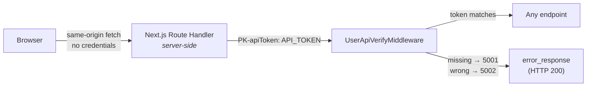

# Authentication and Authorization

## Summary

The entire access-control model is **one shared static token**.

There are no users, no login, no sessions, no roles, no permissions and no per-record authorization.
Any client holding `API_TOKEN` has complete read and write access to every collection, endpoint,
environment, report, schedule, project and document in the system.

This is not a gap in the documentation — it is what the code does. The repository contains a substantial
amount of authentication *scaffolding*, all of it disabled, which makes the system look more protected
than it is.

## The implemented flow



[`UserApiVerifyMiddleware`](../../backend/app/middlewares/auth_middleware.py):

```python
if request.url.path.startswith("/storage"):  return await call_next(request)
if request.url.path in ALLOWED_PATHS:        return await call_next(request)

api_token = request.headers.get("PK-apiToken")
if not api_token:                  return error_response("API Token required", code=5001)
if api_token != env('API_TOKEN'):  return error_response("Invalid API Token", code=5002)
```

`ALLOWED_PATHS = ["/", "/docs", "/redoc", "/openapi.json"]`.

That comparison is the whole of authentication. There is no user lookup, no expiry, no revocation and no
rotation mechanism.

## What is done well

Two aspects of the design are genuinely sound and should be preserved:

**The token never reaches the browser.** `API_TOKEN` deliberately has no `NEXT_PUBLIC_` prefix, so
Next.js excludes it from the client bundle. It is read only inside server-side route handlers, which
attach it before forwarding to FastAPI. A user inspecting network traffic sees same-origin calls with no
credentials.

**No CORS surface.** Because the browser only ever calls same-origin route handlers, FastAPI needs no
CORS configuration, and cross-origin browser access is not possible by default.

## What is missing

| Capability | Status |
| ---------- | ------ |
| User accounts | ❌ No user table. `app.models.users_model` **does not exist** |
| Login / logout | ❌ All routes commented out and not registered |
| Sessions / JWT | ❌ Middleware exists but is unregistered and non-functional |
| Roles | ❌ `PK-role` is accepted, forwarded, and **never read for any decision** |
| Permissions | ❌ None |
| Per-record ownership | ❌ `createdBy`/`updatedBy` are null or hard-coded to `1` |
| Token expiry / rotation | ❌ Static value in `.env` |
| Rate limiting | ❌ None |
| Audit trail | ❌ `logs/requests.log` records requests but no actor |

## The disabled scaffolding

Understanding what is *not* wired up prevents a dangerous misreading of the codebase.

### `login_routes.py` — every route commented out

[`app/routes/login_routes.py`](../../backend/app/routes/login_routes.py) defines `public_router` and
`protected_router` with signup, login, email login, OTP generate/validate, update-password, logout, list,
update and get. **All are commented out**, and neither router is imported by
[`app/main.py`](../../backend/app/main.py).

### `auth_repository.py` — imports a module that does not exist

```python
from app.models.users_model import Users     # no such file
```

Importing this module raises `ImportError`. Nothing imports it, so the error is latent.

### `auth_middleware.py` — two unreachable code paths

`UserSessionVerifyMiddleware` is never registered. `verify_session` is referenced only by the
commented-out `protected_router`. Both contain the same defect:

```python
auth = ''                              # in the middleware
# auth = get_user_session(...)         # in verify_session — commented out
if not auth: ...
if auth.myStatus == 0: ...             # AttributeError / NameError
```

Neither could function if it were enabled.

### `auth_controller.py` / `auth_service.py`

`AuthController` delegates to `AuthService` (816 lines — the largest service in the project) for signup,
login, OTP, password update and session handling. No route reaches either.

### Frontend

- No login page, no signup page, no `middleware.ts`, no route guard.
- `(auth)` and `(main)` are **route groups with no layout** — the names imply protection that does not
  exist. A page under `(auth)` is exactly as public as one under `(main)`.
- `DashboardLayout.handleLogout` POSTs to `/api/logout`, which does not exist. Its button is commented
  out.
- `components/logout.tsx` clears `localStorage.token` and redirects to `/login`. Imported by nothing;
  neither the token nor the route exists.
- `utils/crypto.ts` (AES-256-CBC) and `utils/api.ts`'s `GOOGLE_CLIENT_ID`, `SESSION_SECRET`, `ISSUER_URL`
  and related exports are unused.

## Unreachable error codes

`5003` (invalid session), `5004` (token mismatch), `5010` (account blocked) and `5011` (device blocked)
are defined inside the disabled session code and **can never be returned**. See
[../api/error-codes.md](../api/error-codes.md).

## ID obfuscation is not access control

```python
def encrypt_simple_id(id_value: int) -> str:
    return base64.urlsafe_b64encode(str(id_value).encode()).decode()
```

Collection IDs are base64 — trivially reversible and enumerable (`NQ==` → `5`). Combined with the absence
of ownership checks, guessing an ID grants full access to that record. Treat these as opaque-ish URLs, not
as a security boundary. [AUDIT.md](../../AUDIT.md) issue 8.

Fernet helpers (`encrypt_data`/`decrypt_data`, keyed from `TOKEN_SECRET`) are real encryption but are
used by no active code path.

## Concrete security implications

Anyone with the token can:

- read every collection, including environment variables holding **live credentials** for the systems
  under test;
- read every test report, whose `environment` block contains tokens captured during runs;
- trigger runs, causing outbound HTTP from the backend host to arbitrary stored URLs;
- **save and execute arbitrary JavaScript** via pre/post-request scripts, evaluated by `js2py` inside the
  API process ([AUDIT.md](../../AUDIT.md) issue 7);
- consume the Gemini quota;
- read and delete all projects and documents.

Two further exposures do not even require the token:

**`/storage` is exempt from token verification.** The first line of the middleware waves through any path
beginning `/storage`, and `app.mount("/storage", StaticFiles(directory="storage"))` serves that directory.
Anyone who can reach the backend can download any uploaded collection JSON, any environment file, any test
report and **any uploaded KYC document**, with no credential at all — provided they know or guess the path.
Since paths follow a predictable pattern (`/storage/collections/{small integer}/...`), guessing is not hard.

**Credentials leak into logs.** `logs/requests.log` records full request and response bodies with only
four top-level keys masked, and `connection.py` prints the database password at startup.
[AUDIT.md](../../AUDIT.md) issues 5 and 6.

## Deployment guidance

Given the above, this application should be treated as **an internal tool with no access control of its
own**. Do not expose it to the internet as-is.

If it must be reachable beyond localhost, put the protection outside the application:

1. **Network isolation** — VPN or private subnet; never a public IP.
2. **A reverse proxy that authenticates** — OAuth2 proxy, SSO forward-auth, or at minimum HTTP basic auth
   in front of both the Next.js and FastAPI ports.
3. **Block `/storage` at the proxy**, or move file serving behind an authenticated handler.
4. **Do not expose port 8000 at all.** Only the Next.js port needs to be reachable; FastAPI should listen
   on localhost or a private interface.
5. **Treat `API_TOKEN` as a high-value secret** — long, random, per-environment, and rotated by editing
   both `.env` files and restarting.
6. **Restrict who can save scripts**, since that is arbitrary code execution on the backend host.
7. **Protect the logs and `storage/`** with the same care as production credentials.

## If authentication is added later

The scaffolding is not a usable starting point — `users_model` is absent and both session paths are
broken. A real implementation would need: a users table and model; working session or JWT issuance;
`UserSessionVerifyMiddleware` (or a dependency) actually registered; ownership columns enforced on every
query rather than merely present; a frontend login page and route guard; and `request.state.userId`
replacing the hard-coded `admin_id = 1` and `userId = "U-98WZ41BUTTOM"` constants.

Until then, document and operate the system as unauthenticated.
